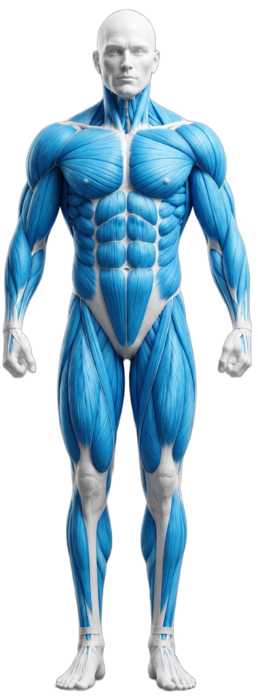

# 🏋️‍♂️ ChikiSet — 3D Muscle Anatomy Workout Tracker & AI Personal Trainer



**ChikiSet** คือเว็บแอปพลิเคชันสำหรับจัดตารางฝึก ออกแบบโปรแกรมเฉพาะบุคคล บันทึกประวัติการยกน้ำหนัก และติดตามมัดกล้ามเนื้อด้วย **โมเดลกล้ามเนื้อ 3D (3D Muscle Anatomy System)** พร้อมระบบแนะนำโปรแกรมจาก **AI Personal Trainer Engine** ที่วิเคราะห์อุปกรณ์ที่มีจริงในบ้านหรือยิมของคุณแบบ 100%

🌐 **เข้าใช้งานออนไลน์ได้ทันที (Live Demo):**  
👉 **[https://meechiki.github.io/ChikiSet/](https://meechiki.github.io/ChikiSet/)**

---

## ✨ ฟีเจอร์เด็ดของระบบ (Key Features)

### 🧬 1. โมเดลกล้ามเนื้อ 3D สมจริง (3D Muscle Model & Interactive Hotspots)
- **สลับมุมมอง 3D ด้านหน้า - ด้านหลัง (Front / Back View)** ด้วยภาพเรนเดอร์กล้ามเนื้อคมชัด 3D
- **ระบบ SVG Hotspots สัดส่วน 1:1**: สามารถจิ้มที่มัดกล้ามเนื้อบนตัวหุ่น 3D (เช่น อกบน, ปีก, ไบเซ็ป, สะโพก, ต้นขาหน้า ฯลฯ) เพื่อให้ระบบคัดกรองท่าฝึกเฉพาะมัดนั้นๆ ขึ้นมาทันที
- **เรืองแสงตอบสนอง (Interactive Glow)** เมื่อวางเมาส์หรือกดเลือกมัดกล้ามเนื้อ

### 🏋️‍♂️ 2. ฐานข้อมูลท่าออกกำลังกายกว่า 220+ ท่า (220+ Real-World Exercises)
- รวบรวมท่าฝึกครอบคลุมทุกมัดกล้ามเนื้อทั่วร่างกาย และทุกประเภทอุปกรณ์จริง:
  - 🏋️‍♂️ **บาร์เบล / อีซี่บาร์ (Barbell / EZ-Bar)**
  - 🧱 **ดัมเบล (Dumbbell)**
  - ⚙️ **เครื่องเล่นแมชชีน (Gym Machines)**
  - 🔒 **สมิธแมชชีน (Smith Machine)**
  - 🔌 **สายเคเบิล (Cable Machine)**
  - 🔔 **เคทเทิลเบล (Kettlebell)**
  - 🤸‍♂️ **น้ำหนักตัว / Calisthenics (Bodyweight & Pull-Up Bar)**
  - 🎗 **ยางยืดแรงต้าน (Resistance Band)**
- แสดงป้ายกำกับ **`🛋️ ม้านั่ง`** สำหรับท่าที่จำเป็นต้องใชัเก้าอี้ปรับระดับ เพื่อความสะดวกในการวางแผนอุปกรณ์

### 🎛 3. ตัวกรอง 3 ชั้นแบบ FLIXO Minimalist (3-Tier Filter System)
- **ชั้นที่ 1 (Main Muscle Groups)**: กรองตามกลุ่มกล้ามเนื้อหลัก (ทั้งหมด, แขน, อก, หลัง, ไหล่, หน้าท้อง, ขา & สะโพก, อื่นๆ)
- **ชั้นที่ 2 (Sub-Categories)**: กรองเจาะจงมัดกล้ามเนื้อย่อย (เช่น ไบเซ็ป, ไตรเซ็ป, อกบน, ปีก, สะบัก, น่อง ฯลฯ)
- **ชั้นที่ 3 (Equipment Bar)**: กรองเฉพาะอุปกรณ์ที่มีจริง เพื่อตัดท่าที่ไม่ต้องการออกได้ใน 1 คลิก

### 🤖 4. แบบสอบถามวิเคราะห์โปรแกรมเฉพาะบุคคล (AI Personal Trainer Consultation)
- **ระบบประเมิน 5 ขั้นตอน เสมือนมีเทรนเนอร์ส่วนตัวดูแล**:
  1. 🎯 **เป้าหมายหลัก**: สร้างกล้ามเนื้อ (Hypertrophy 8-12 reps) / เพิ่มพละกำลัง (Strength 3-6 reps) / ลดไขมัน (Fat Loss 12-15 reps)
  2. 📅 **ความถี่ที่สะดวกฝึก**: 2-3 วัน (Full Body) / 4 วัน (Upper-Lower) / 5-6 วัน (Push-Pull-Legs)
  3. 🛠️ **เช็กลิสต์อุปกรณ์ที่มีจริง (Interactive Checklist)**: เลือกติ๊กอุปกรณ์ที่มีในบ้าน/ยิมของคุณ (ดัมเบล, บาร์เบล, ม้านั่ง, เคเบิล, แมชชีน, สมิธ, เคทเทิลเบล, ยางยืด, บอดี้เวท)
  4. 💪 **เน้นกล้ามเนื้อจุดพิเศษ**: ทั่วร่างกาย / เน้นช่วงบน / เน้นช่วงล่าง & สะโพก / เน้นแขน & ไหล่
  5. 🔰 **ระดับประสบการณ์**: มือใหม่ (0-6 เดือน) / ระดับปานกลาง (6 เดือน - 2 ปี)
- **สร้างตารางฝึกและท่าเล่นที่ใช้อุปกรณ์ของคุณได้จริง 100%** พร้อมบทวิเคราะห์คำแนะนำการฝึกเฉพาะบุคคล (Tempo, Rest, Progressive Overload) และปุ่มกดสร้างเข้าตารางใน 1 คลิก!

### 📅 5. ตารางของฉัน & บันทึกประวัติ (My Schedule & Workout Tracker)
- **สร้างวันฝึกได้อิสระ** หรือเลือกใช้โปรแกรมสำเร็จรูปยอดนิยม (Push/Pull/Legs, Upper/Lower, Full Body)
- **บันทึกเซ็ตการฝึก**: บันทึกน้ำหนัก (กก.) และจำนวนครั้ง (Reps) ในแต่ละเซ็ต เพิ่ม/ลบเซ็ตได้สะดวก
- **ย้อนดูประวัติการฝึก**: เลือกระบุวันที่ฝึกย้อนหลังได้ บันทึกประวัติแยกตามวันโดยอัตโนมัติ
- **ติดตามความต่อเนื่อง 7 วัน (Streak Strip)**: แสดงสถานะการซ้อมประจำสัปดาห์ (อา-ส)

### ⏱️ 6. ระบบจับเวลาพักบิวต์อิน (Header Rest Timer)
- ฝังอยู่บนแถบ Header ด้านบนของเว็บ สามารถกดปุ่ม **"พัก 90s"** จากการเล่นแต่ละเซ็ตเพื่อเริ่มจับเวลาถอยหลังได้ทันที
- ปุ่มเลือกเวลารวดเร็ว (60s / 90s / 120s)
- **ระบบแจ้งเตือนด้วยเสียงบี๊บ และสั่นบนมือถือ (Vibration)** เมื่อครบเวลาพัก

### 🎨 7. ดีไซน์มินิมอลอ่านง่ายระดับสายตา (Minimalist FLIXO Aesthetics)
- **ขยายฟอนต์ใหญ่ คมชัด อ่านง่าย**: ปรับขนาดตัวอักษรให้อ่านสบายตา ไม่ต้องเพ่ง (ชื่อท่า 15px, หัวข้อ 16-18px)
- **จัดวางระดับสายตา (Eye-Level Zero Scroll)**: ล็อกสัดส่วนความสูง Layout ให้พอดีกับหน้าจอ ไม่ต้องไถสกอร์ลเมาส์ขึ้นลงเยอะ
- **รองรับ Theme สว่าง/มืด (Light & Dark Mode)** สลับได้ที่มุมขวาบน

---

## 📖 วิธีการใช้งาน (How to Use)

### 1. การดูท่าและใช้โมเดลกล้ามเนื้อ 3D
1. เข้ามาที่หน้าแรกในแท็บ **"💪 คลังท่าออกกำลังกาย"**
2. กดเลือกหมวดหมู่ที่แถบด้านบน หรือคลิกมัดกล้ามเนื้อบน **หุ่น 3D ด้านขวา** (สามารถกดปุ่ม "ด้านหน้า / ด้านหลัง" เพื่อหมุนหุ่นได้)
3. ระบบจะแสดงรายการท่าออกกำลังกายของมัดกล้ามเนื้อนั้นๆ พร้อมประเภทอุปกรณ์และป้ายกำกับม้านั่ง

### 2. การสร้างตารางด้วย AI Personal Trainer
1. สลับไปที่แท็บ **"📅 ตารางของฉัน"**
2. กดปุ่ม **`🤖 ทำแบบสอบถามแนะนำโปรแกรมเฉพาะคุณ`**
3. ตอบคำถาม 5 ข้อ และติ๊กเลือกอุปกรณ์ที่คุณมีในข้อ 3
4. ระบบจะวิเคราะห์คำแนะนำ และกดปุ่ม **`🚀 ยืนยันสร้างตารางตามคำแนะนำเทรนเนอร์`** เพื่อสร้างวันฝึกพร้อมท่าเล่นเข้าตารางของคุณทันที

### 3. การจดบันทึกการซ้อมประจำวัน
1. ในหน้า **"📅 ตารางของฉัน"** กดคลิกที่การ์ดวันฝึกเพื่อเปิดดูรายการท่า
2. ใส่น้ำหนัก (กก.) และจำนวนครั้ง (Reps) ที่ยกได้จริงในแต่ละเซ็ต
3. เมื่อยกเสร็จแต่ละเซ็ต กดปุ่ม **`⏱ พัก 90s`** เพื่อเริ่มจับเวลาพักถอยหลังบน Header

---

## 🛠️ เทคโนโลยีที่ใช้ (Tech Stack & Architecture)

- **Frontend Core**: HTML5 + Vanilla CSS3 (Custom Design Tokens, Glassmorphism, Responsive Flex/Grid) + Pure JavaScript (ES6+, Classless Component-Free Engine)
- **Vector Hotspots System**: SVG Responsive Vector Overlay สอบทานสัดส่วน 1:1 กับไฟล์ภาพ 3D Rendered Textures (`front_head_ok.png` และ `back_head_ok.png`)
- **Data Storage**: Browser `localStorage` API (บันทึกข้อมูลทุกอย่างแบบ Offline ปลอดภัย ข้อมูลไม่หลุดออกนอกเครื่อง)
- **Hosting & Deployment**: GitHub Pages (ซิงก์ 1:1 ระหว่าง `index.html` และ `ChikiSet.html`)

---

## 📁 โครงสร้างไฟล์ในโปรเจกต์ (Project Structure)

```text
ChikiSet/
├── index.html           # ไฟล์หลักของเว็บแอปพลิเคชัน (GitHub Pages Target)
├── ChikiSet.html        # ไฟล์ mirror 1:1 สำหรับใช้งานสำรอง/สแตนด์อโลน
├── front_head_ok.png    # ภาพเรนเดอร์โมเดลกล้ามเนื้อ 3D ด้านหน้า
├── back_head_ok.png     # ภาพเรนเดอร์โมเดลกล้ามเนื้อ 3D ด้านหลัง
├── README.md            # คู่มือและรายละเอียดโครงการ
└── .nojekyll            # ปิดการประมวลผล Jekyll สำหรับ GitHub Pages
```

---

## 💾 การจัดเก็บและสำรองข้อมูล (Data Privacy & Storage)

- ข้อมูลประวัติการยก น้ำหนัก เซ็ต วันฝึก และตารางทั้งหมดถูกบันทึกไว้ใน **LocalStorage** บนเบราว์เซอร์ของอุปกรณ์คุณเท่านั้น
- **100% Privacy & Offline**: ไม่มีการส่งข้อมูลไปยังเซิร์ฟเวอร์ภายนอก สามารถใช้งานได้แม้อยู่ในโหมดออฟไลน์
- *ข้อควรระวัง*: หากมีการล้างแคชหรือ Clear Browser Data ข้อมูลอาจสูญหายได้

---

Developed with ❤️ for Fitness Enthusiasts & Lifters worldwide.  
*ChikiSet — Master Your Sets, Build Your Dream Physique.*
